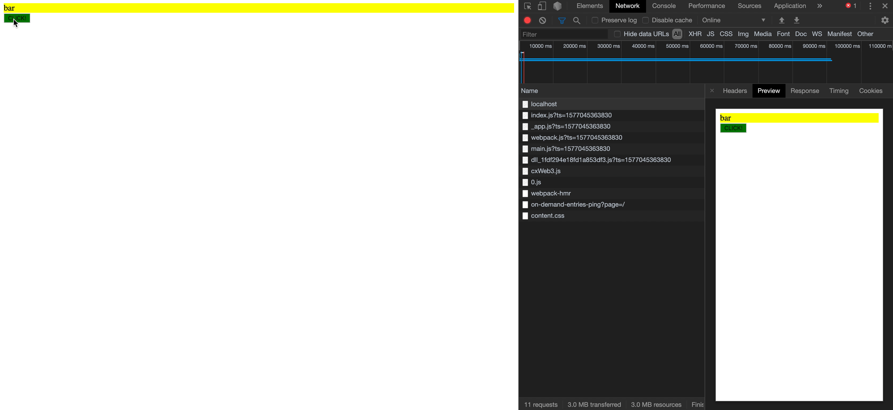
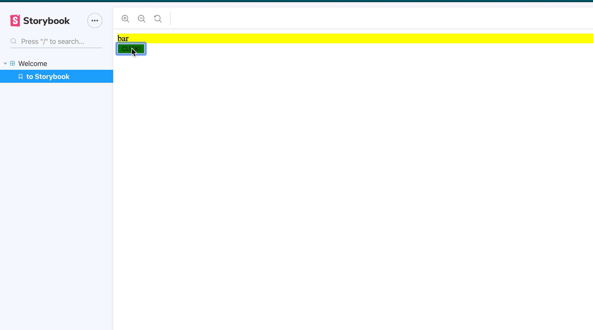

# SSR CSS in JS component library. 
Trying to build a component library with CSS in JS libraries, to then load through next.js

## Get running

```
yarn install
yarn run build
yarn start
```

Opens up a server at localhost:3000

Want to see the storybook of the component library.

Go to packages/tsdx-styled-comps-lib
run yarn storybook

# Issue in gifs
When loaded with next

When loaded inside the storybook


# Background
Trying to get styled-componenst with a component library to load properly in next.js
It is difficult to get that to work! Tried all different setups.

Im only able to achieve with two different setups, see old-setup branch: 
* Either only client load, getting a flash of unstyled content
* Full loading from next.js, but the client that mounts after load, is unstyled. This problem is the one that is on master now.

Have some issues out for feelers:
https://github.com/zeit/next.js/issues/9812
https://github.com/jaredpalmer/tsdx/issues/390

Other issues related to my first attempt with webpack, see branch, old-setup:
https://github.com/emotion-js/emotion/issues/1516
https://github.com/styled-components/styled-components/issues/2442
https://github.com/kiwicom/orbit-components/issues/1404


# Alternative solution angles

## CJS not for frontend
I thought maybe commonJS was not able to transpile in fronted, went to ESM as can be seen in package.json -> main. But this did not help.
Tried the same for UMD, to no luck

## Using different packages of styled-components
This is not an issue now, as I use peer depenedencies and yarn workspace so they share the same package. It works for react so guess it should work for styled-components.

## Client doesnt load
Well it does as the javascript works fine.
I even removed the code that is in pages/_document.js, then the preview coming from the backend, is unstyled, and I get a flashed of unstyled content.
So the client loads, but missing styles of unmounted code.

